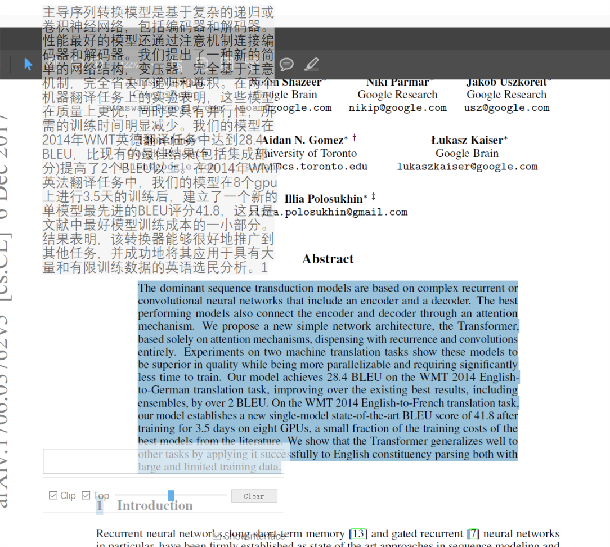

A sample toolkit design for Paper reading. Translate
from English to Chinese 



# Instruction
Implement by PySide2, and use [YouDao translator API](https://ai.youdao.com/gw.s).

When you copy some English text the toolkit will translate
to Chinese. And it can show the detail explanation of single word.

Can easily extend to other languages and other translator platform.

Linebreaks in the paragraphs will be replaced by space.
Especially, for source code of python, the "#"s in its documents will
also be ignored.

The Window can be set to always on top and can be dragged for convenience.

# Get Started
Using Python 3.x. Pre requirements list in requirements.txt.

You need to apply a [YouDao translator instance](https://ai.youdao.com/gw.s)
 before start. Reach your application ID and secret key, and fill them into following 
 json file ``config.json`` under the root directory:

```json
{
  "APP_KEY": "Your app ID",
  "APP_SECRET": "Your secret key"
}
```

Run
``
python main.py
``
to enter the main program.

# How to Use
After run the entry file, a semi-opaque bar will show under the left-bottom of your 
screen. You can drag the bar to adjust the horizontal position of this widget.

When you copy some text, the translation will show and be selected automatically on the left-top of 
your screen. You can copy this text, and you can also click the text once to cancel copy.

Toggle the check box "Show Interface" on the left-bottom bar will show some simple 
settings and a input editor of widget.

- Check box "Clip" decides whether the widget receive copy text in the clipboard.
- Check box "Top" decides whether the widget is always on the top.
- Slider decides the opacity of the interface frame.
- Button "Clear" can clear the content of left-top translation.

Also, you can enter text in the input editor in the interface frame. The translation
will also be shown at left-top of the screen.